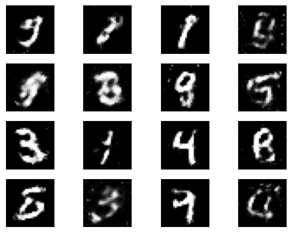

    
# GANs Model Implementation

This repository contains the implementation of a Generative Adversarial Network (GAN) model. Below you will find details from the Jupyter notebook that showcases the implementation and results.

---

# GANS model for image generation using MNIST Dataset

- This GANS model is trained on the MNIST dataset. The Generator is trained on noise data and the loss computed helps learn the appropriate latent space.
- Increasing the number of epochs and utilzing more than one loss value helps avoid mode collapse.
- The GANS model successfully learns the latent space to generate more hand-written digit samples with different variations

The Generator creates more images and the discriminator learns to classify whether the image is real or fake. Based on the discriminators results, the generator is then used to create more samples and the this process is repeated with each epoch. The goal for the discriminator is set to ensure that the generator produced images are easy to identify whereas the generator is incentivised to learn to produce images that the discriminator is unable to identify as fake.

MNIST Dataset
The MNIST dataset is a famous dataset in the field of machine learning. It consists of 28x28 pixel grayscale images of handwritten digits (0-9). The dataset contains 60,000 training images and 10,000 test images, making it a suitable choice for various machine learning tasks, including digit classification and image generation.

Its significance lies in its simplicity, making it a benchmark dataset for testing new machine learning algorithms and models. Researchers and developers often use MNIST as a starting point for experimenting with deep learning techniques because of its small size and easy-to-understand structure.

### Introduction to GANs
Generative Adversarial Networks (GANs) are a class of deep learning models designed for generative tasks. They consist of two key components: the Generator and the Discriminator. The Generator attempts to create data (e.g., images) from random noise, while the Discriminator aims to distinguish between real data and fake data produced by the Generator.

In a GAN, these two networks are trained simultaneously through a competitive process. The Generator gets better at creating data that mimics the real data distribution over time, and the Discriminator gets better at distinguishing real from fake data. This adversarial process helps the Generator improve its ability to generate realistic data, making GANs especially useful for image generation tasks.

Generative Adversarial Networks (GANs) are a class of deep learning models designed for generative tasks. They consist of two key components: the Generator and the Discriminator. The Generator attempts to create data (e.g., images) from random noise, while the Discriminator aims to distinguish between real data and fake data produced by the Generator.

In a GAN, these two networks are trained simultaneously through a competitive process. The Generator gets better at creating data that mimics the real data distribution over time, and the Discriminator gets better at distinguishing real from fake data. This adversarial process helps the Generator improve its ability to generate realistic data, making GANs especially useful for image generation tasks.

## Challenges faced and future updates
- The model is a generalized one and can be used to generate more hand-written digit samples, or further customized to use conditions to produce completely different results
- Limited Data and the computational complexity of training 2 models at each epoch makes the training process cumbersome and time consuming. This model used the MNIST dataset which has input data that can be managed on limited resources but the model can easily be scaled up to handle more datasets and use cases


### Load packages
torch: PyTorch is a deep learning framework for building and training neural networks.

torch.nn: PyTorch's neural network module for defining neural network architectures.

torch.optim: PyTorch's optimization library for defining optimizers (e.g., Adam).

datasets, transforms: These modules from torchvision provide tools for working with datasets and data transformations.

DataLoader: Helps in loading and batching data.

matplotlib.pyplot: Used for data visualization.


```python
import torch
import torch.nn as nn
import torch.optim as optim
import torchvision
from torchvision import datasets, transforms
from torch.utils.data import DataLoader
import matplotlib.pyplot as plt
```

### Load Dataset

setting up a batch size, transforming the images to tensors, and normalizing them. This normalization scales the pixel values to the range [-1, 1], which helps training stability by making it easier for the generator and discriminator to work with.


This code is written in Python and is used to set up a data pipeline for processing the MNIST dataset using PyTorch's built-in functions.

Let's go through the code step by step:

1. The first line sets the `batch_size` variable to 64. This will determine how many samples are processed together in each iteration of the data pipeline.

2. The next line defines a series of transformations to be applied to the input data. The `transforms.Compose` function takes a list of transformations and chains them together. In this case, two transformations are applied:
   - `transforms.ToTensor()` converts the input image data into a PyTorch tensor, which is the standard format for working with data in PyTorch.
   - `transforms.Normalize((0.5,), (0.5,))` normalizes the data by subtracting the mean value of 0.5 from each pixel and dividing by the standard deviation of 0.5. This helps in faster convergence of the model during training.

3. The next line creates an instance of the `MNIST` dataset class provided by PyTorch. This class is used to load and preprocess the MNIST dataset. The arguments passed to the `datasets.MNIST` constructor are as follows:
   - `root='./data'` specifies the directory where the dataset will be stored. If the dataset is not already present, it will be downloaded to this directory.
   - `train=True` indicates that the training set should be loaded. If set to `False`, the test set will be loaded instead.
   - `transform=transform` specifies the transformations to be applied to the data. In this case, the transformations defined earlier will be applied to the loaded dataset.
   - `download=True` specifies that the dataset should be downloaded if it is not already present in the specified directory.

4. Finally, the `DataLoader` class is used to create an iterator over the `mnist_dataset`. The `DataLoader` takes the following arguments:
   - `mnist_dataset` is the dataset object that should be iterated over.
   - `batch_size=batch_size` specifies the number of samples to be included in each mini-batch. In this case, `batch_size` is set to 64, as defined earlier.
   - `shuffle=True` indicates that the data should be randomly shuffled before each epoch of training. This helps in preventing any bias that could arise from the order of the samples.

Overall, this code sets up the MNIST dataset for training a machine learning model. It applies the specified transformations to the input data and uses a `DataLoader` to provide mini-batches of data for training or evaluation purposes.


```python
batch_size = 64
transform = transforms.Compose([
    transforms.ToTensor(),
    transforms.Normalize((0.5,), (0.5,))
])
mnist_dataset = datasets.MNIST(
    root='./data', train=True, transform=transform, download=True)
dataloader = DataLoader(mnist_dataset, batch_size=batch_size, shuffle=True)
```


## Generating Sample Images


This code snippet is written in Python and uses the PyTorch library along with matplotlib for visualization purposes. Let's break it down step by step:

1. `sample_images, _ = next(iter(dataloader))`: This line retrieves a batch of sample images from the `dataloader`. A dataloader is a PyTorch utility that helps iterate through a dataset in batches. It returns both the images and their corresponding labels, but here we only assign the images to `sample_images`. The underscore "_" represents a variable that we don't need or care about in this case.

2. `sample_images_grid = torchvision.utils.make_grid(sample_images[:16], nrow=4, padding=2, normalize=True)`: The `make_grid` function from the `torchvision.utils` module takes a batch of images and arranges them in a grid. In this case, it takes the first 16 images from `sample_images` (using slicing `[:16]`), arranges them in a grid with 4 rows (`nrow=4`), adds padding of 2 pixels between each image (`padding=2`), and normalizes the pixel values to the range [0, 1] (`normalize=True`). The result is stored in the `sample_images_grid` variable.

3. `plt.imshow(sample_images_grid.permute(1, 2, 0))`: This line uses `plt.imshow` from the matplotlib library to display the grid of images. The `permute(1, 2, 0)` function rearranges the dimensions of `sample_images_grid` so that the image dimensions are in the correct order for matplotlib. By default, matplotlib expects the channel dimension to be the last dimension, but PyTorch stores it as the first dimension. The `permute` function rearranges the dimensions accordingly.

4. `plt.axis('off')`: This line turns off the axis ticks and labels for the plot, making it cleaner and more focused on the images.

5. `plt.show()`: Finally, this line displays the image grid plot.

In summary, this code snippet fetches a batch of sample images, arranges them in a grid, and displays the grid using matplotlib.


```python
# Here are sample images from the dataset
sample_images, _ = next(iter(dataloader))
sample_images_grid = torchvision.utils.make_grid(
    sample_images[:16], nrow=4, padding=2, normalize=True)
plt.imshow(sample_images_grid.permute(1, 2, 0))
plt.axis('off')
plt.show()
```


    

    


### Define GANS model


```python
# Define the generator and discriminator networks
class Generator(nn.Module):
    def __init__(self, latent_dim, output_dim):
        super(Generator, self).__init__()
        self.main = nn.Sequential(
            nn.Linear(latent_dim, 256),
            nn.ReLU(),
            nn.Linear(256, output_dim),
            nn.Tanh()
        )

    def forward(self, x):
        return self.main(x)


class Discriminator(nn.Module):
    def __init__(self, input_dim):
        super(Discriminator, self).__init__()
        self.main = nn.Sequential(
            nn.Linear(input_dim, 256),
            nn.LeakyReLU(0.2),
            nn.Linear(256, 1),
            nn.Sigmoid()
        )

    def forward(self, x):
        return self.main(x)
```

### Train the model


This code defines two neural network classes: Generator and Discriminator. These neural networks are commonly used in Generative Adversarial Networks (GANs).

The Generator class is responsible for generating fake samples that resemble the real data. It takes as input a random noise vector x from a latent space and passes it through a sequence of linear layers and activation functions. The input dimension of the first linear layer is the latent_dim, which represents the size of the latent space. The output dimension of the last linear layer is the output_dim, which represents the size of the generated samples. In between, there are ReLU activation functions applied to the intermediate hidden layers. Finally, the output is passed through a Tanh activation function to squash the values between -1 and 1. The forward method of this class performs the forward pass through the network and returns the generated samples.

The Discriminator class, on the other hand, is responsible for distinguishing between real and fake samples. It takes as input a sample x (either real or generated) and passes it through a sequence of linear layers and activation functions. The input dimension of the first linear layer matches the input_dim, which represents the size of the input samples. The output dimension of the last linear layer is 1, as it outputs a single value indicating the probability that the input sample is real. In between, there are leaky ReLU activation functions applied to the intermediate hidden layers, which helps prevent the gradients from becoming too small. Finally, the output is passed through a Sigmoid activation function to squash the value between 0 and 1, representing the probability. The forward method of this class performs the forward pass through the network and returns the probability of the input sample being real.

In summary, the Generator class generates fake samples based on random noise, while the Discriminator class distinguishes between real and fake samples. These two classes are typically used together in a GAN framework, where the generator tries to generate more realistic samples over time by fooling the discriminator, and the discriminator tries to correctly classify the samples as real or fake.


```python
# Hyperparameters
latent_dim = 100
image_size = 28 * 28
batch_size = 64
epochs = 200
visualize_interval = 3 


# Define GAN components
generator = Generator(latent_dim, image_size)
discriminator = Discriminator(image_size)

# Loss function and optimizers
criterion = nn.BCELoss()
optimizer_G = optim.Adam(generator.parameters(), lr=0.0002)
optimizer_D = optim.Adam(discriminator.parameters(), lr=0.0002)

# Load the MNIST dataset
transform = transforms.Compose([
    transforms.ToTensor(),
    transforms.Normalize((0.5,), (0.5,))
])

mnist_dataset = datasets.MNIST(root='./data', train=True, transform=transform, download=True)
dataloader = DataLoader(mnist_dataset, batch_size=batch_size, shuffle=True)

# Training loop
for epoch in range(epochs):
    for i, (real_images, _) in enumerate(dataloader):
        batch_size = real_images.size(0)
        real_images = real_images.view(-1, image_size)

        # Train Discriminator
        optimizer_D.zero_grad()
        real_labels = torch.ones(batch_size, 1)
        fake_labels = torch.zeros(batch_size, 1)

        # Discriminator on real data
        real_outputs = discriminator(real_images)
        d_loss_real = criterion(real_outputs, real_labels)
        d_loss_real.backward()

        # Discriminator on fake data
        noise = torch.randn(batch_size, latent_dim)
        fake_images = generator(noise)
        fake_outputs = discriminator(fake_images.detach())
        d_loss_fake = criterion(fake_outputs, fake_labels)
        d_loss_fake.backward()

        optimizer_D.step()

        # Train Generator
        optimizer_G.zero_grad()
        fake_outputs = discriminator(fake_images)
        g_loss = criterion(fake_outputs, real_labels)
        g_loss.backward()
        optimizer_G.step()

        if i % 400 == 0:
            print(
                f"[Epoch {epoch}/{epochs}] [Batch {i}/{len(dataloader)}] [D loss: {d_loss_real + d_loss_fake:.4f}] [G loss: {g_loss:.4f}]"
            )

    if epoch % visualize_interval == 0:
        # Generate and display images
        generator.eval()
        with torch.no_grad():
            noise = torch.randn(16, latent_dim)
            generated_images = generator(noise).view(-1, 1, 28, 28)
            fig, axs = plt.subplots(4, 4)
            for i in range(4):
                for j in range(4):
                    axs[i, j].imshow(generated_images[i * 4 + j][0], cmap='gray')
                    axs[i, j].axis('off')
            plt.show()

```

    [Epoch 0/200] [Batch 0/938] [D loss: 1.3213] [G loss: 0.6705]
    [Epoch 0/200] [Batch 400/938] [D loss: 0.2763] [G loss: 1.9455]
    [Epoch 0/200] [Batch 800/938] [D loss: 0.7840] [G loss: 1.1861]


    

    


    

    


    

    


    

    


    

    


### Evaluate trained model

This code demonstrates the generation and display of images using a trained generator model. Let's break it down step by step:

1. `generator.eval()`: This line sets the generator model into evaluation mode. In PyTorch, the `eval()` method is used to switch off any dropout or batch normalization layers, ensuring consistent behavior during inference.

2. `with torch.no_grad():`: This block of code temporarily disables gradient calculation and tracking. It allows for more efficient computations when we don't need gradients, like during inference.

3. `noise = torch.randn(16, latent_dim)`: Here, we generate random noise for the generator. The `torch.randn()` function creates a tensor of size (16, latent_dim) filled with random values following a standard normal distribution.

4. `generated_images = generator(noise).view(-1, 1, 28, 28)`: We pass the generated noise through the generator model to obtain 16 generated images. The `view()` method reshapes the output tensor to have dimensions (-1, 1, 28, 28), where -1 is inferred based on the other dimensions. The resulting tensor has a shape of (16, 1, 28, 28), representing 16 grayscale images of size 28x28.

5. `fig, axs = plt.subplots(4, 4)`: This line creates a figure with a grid of subplots, organized in a 4x4 layout. The `fig` variable represents the figure object, and the `axs` variable contains a 2D numpy array of axes objects, where each element represents a subplot.

6. `for i in range(4):`: This loop iterates over the rows of the subplot grid.

7. `for j in range(4):`: This nested loop iterates over the columns of the subplot grid.

8. `axs[i, j].imshow(generated_images[i * 4 + j][0], cmap="gray")`: For each subplot, we use the `imshow()` function from matplotlib to display the generated image at index `i * 4 + j` from the `generated_images` tensor. The `[0]` indexing is used to access the image tensor as a 2D array. The `cmap="gray"` argument sets the colormap to grayscale, indicating that we want to display the images in black and white.

9. `axs[i, j].axis("off")`: This line turns off the axis labels for each subplot, resulting in a cleaner image display.

10. `plt.show()`: Finally, this command displays the generated images in a window.

Overall, the code generates 16 random noise vectors, feeds them through the generator model, and displays the resulting generated images in a 4x4 grid using matplotlib.


```python
# Generate some samples
generator.eval()
with torch.no_grad():
    noise = torch.randn(16, latent_dim)
    generated_images = generator(noise).view(-1, 1, 28, 28)

# Display generated images
fig, axs = plt.subplots(4, 4)
for i in range(4):
    for j in range(4):
        axs[i, j].imshow(generated_images[i * 4 + j][0], cmap="gray")
        axs[i, j].axis("off")
plt.show()
```


### Result after 200 Epochs    

    
### Result after 200 Epochs    

    


### Conclusion
In this project, I successfully implemented a Generative Adversarial Network (GAN) to generate realistic images of handwritten digits using the MNIST dataset. The GAN architecture consisted of a Generator and a Discriminator, which were trained adversarially to improve the quality of generated images.

The results of this project demonstrate the capability of the GAN to learn and generate diverse samples of handwritten digits. The generated images show a progression from random noise to recognizable digit patterns, indicating that the Generator has learned meaningful representations from the data.

This project not only serves as a valuable learning experience but also showcases my proficiency in deep learning and GANs. It highlights my ability to design, train, and evaluate complex neural networks for generative tasks.

### Challenges Faced
During the development of this project, I encountered several challenges:

1. **Mode Collapse**: There were instances when the Generator failed to produce a diverse range of digit samples, leading to mode collapse. Addressing this challenge required careful tuning of hyperparameters and architectural modifications to encourage diversity in generated outputs.

2. **Training Instability**: GAN training can be notoriously unstable. I faced issues like the vanishing gradients problem, which affected the training process. I mitigated this by adjusting learning rates and applying gradient clipping.

3. **Resource Constraints**: While working with the MNIST dataset is manageable on limited resources, scaling up to larger datasets and more complex models can be computationally intensive. Future work could involve optimizing the model and training process for more extensive datasets.

### Future Work
Looking ahead, there are several avenues for future work and improvements:

1. **Architectural Enhancements**: Exploring more advanced GAN architectures, such as DCGAN (Deep Convolutional GAN) or StyleGAN, can lead to even better image generation results. These architectures have shown remarkable performance in generating high-quality images.

2. **Hyperparameter Tuning**: Continuously fine-tuning hyperparameters and conducting extensive experiments can help improve the stability and convergence of GAN training. Techniques like learning rate schedules and progressive growing can be explored.

3. **Larger Datasets**: Expanding beyond MNIST to more diverse and complex datasets, such as CIFAR-10 or ImageNet, would be a natural progression. Handling larger datasets would require optimizing memory and computation resources.

4. **Conditional GANs**: Implementing conditional GANs, where specific digit classes or attributes can be controlled during image generation, could be a fascinating extension of this project. This would allow for more targeted image synthesis.

5. **Deployment**: Taking the trained GAN model and deploying it as part of an interactive web application or mobile app could showcase the practical applications of generative models and enhance the project's visibility.

In conclusion, this portfolio project serves as a strong testament to my expertise in deep learning, GANs, and machine learning in general. It demonstrates my ability to tackle complex challenges, improve model performance, and envision future improvements. I look forward to further refining this project and exploring new horizons in the exciting field of generative AI.


## Installation and Setup

1. Clone this repository.
2. Install the required packages listed in the notebook.
3. Run the Jupyter notebook.

## Contributing

Feel free to fork this repository, make changes, and submit pull requests. If you find any bugs or have suggestions, please open an issue.

## License

This project is licensed under the MIT License.

---

*Note: This README was generated automatically from a Jupyter notebook.*

    
